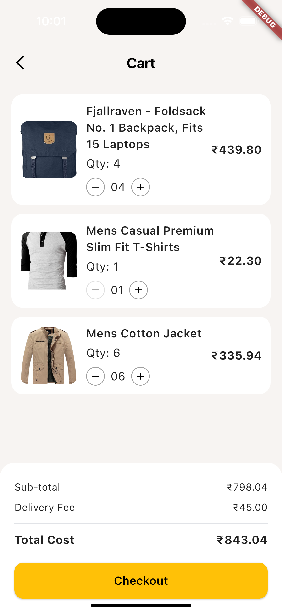
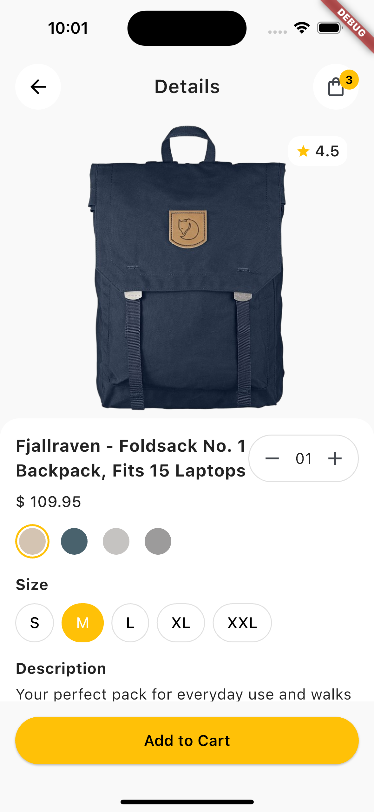
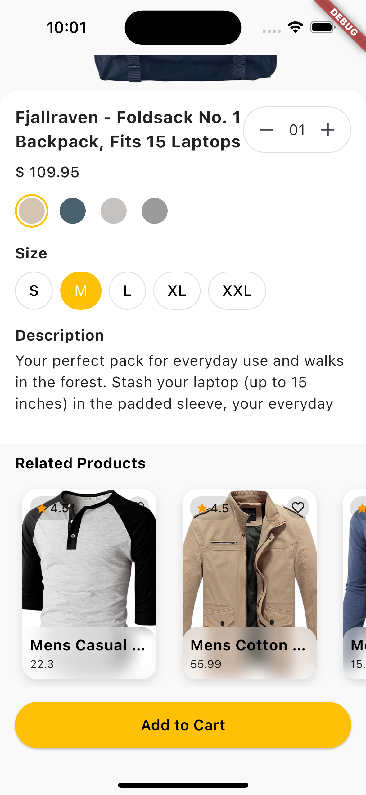
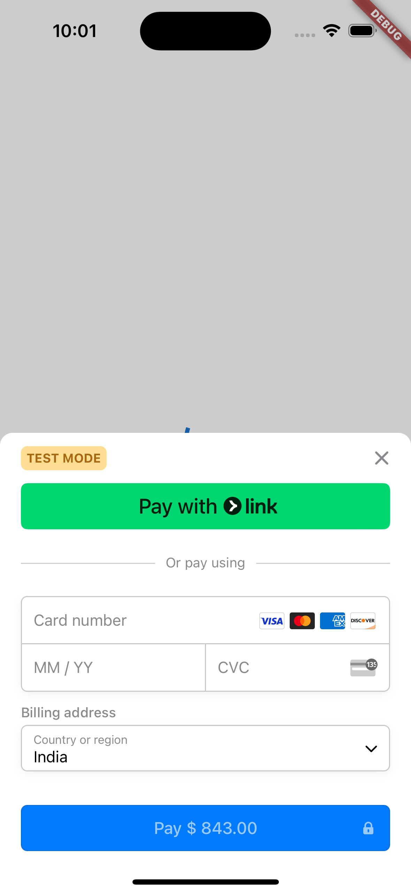
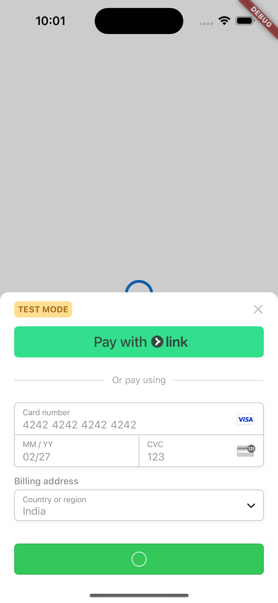
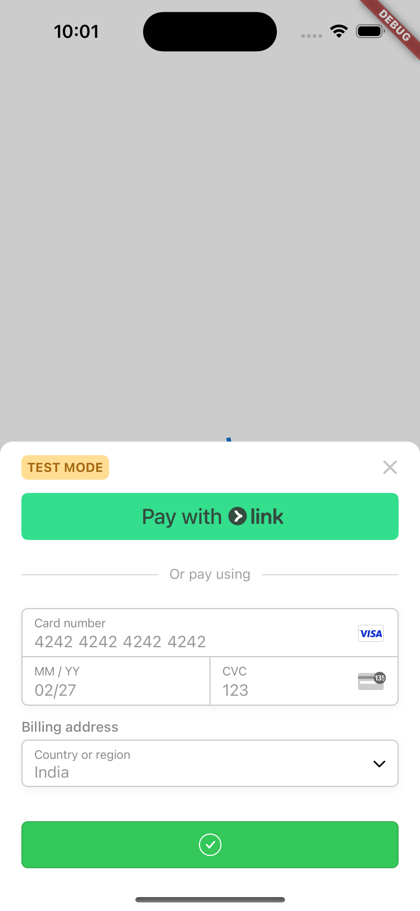
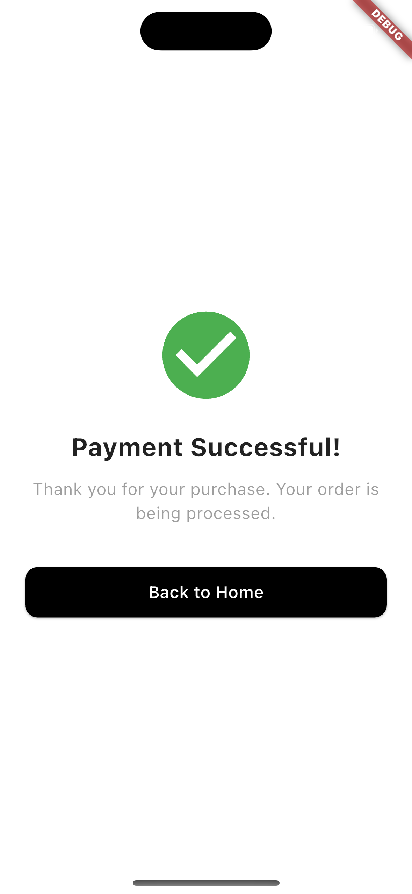
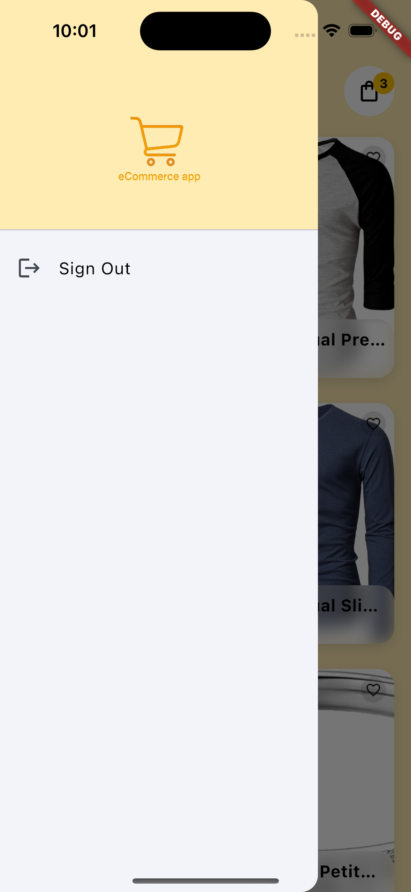
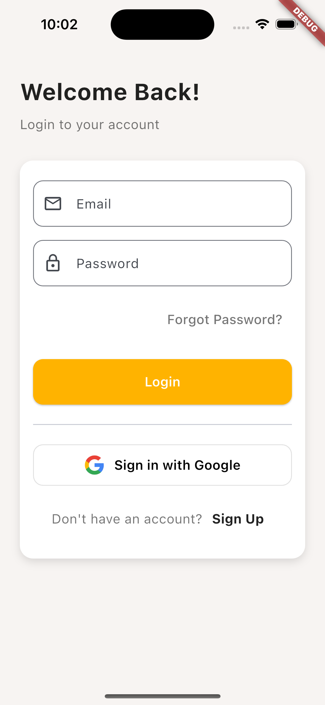

# E-Commerce Flutter App

A modular, scalable, and production-ready e-commerce application built with Flutter, featuring robust state management, dependency injection, theming, localization, and comprehensive testing.

---

## 📸 Screenshots

<p align="center">
  
  
  
  
  
  
  
  
  
  
</p>


## 🚀 Setup & Installation

### Prerequisites
- [Flutter SDK](https://flutter.dev/docs/get-started/install) (3.x recommended)
- Dart (comes with Flutter)
- [Firebase CLI](https://firebase.google.com/docs/cli) (if using Firebase features)
- [Stripe account](https://dashboard.stripe.com/register) (for payment integration)

### 1. Clone the Repository
```sh
git clone <your-repo-url>
cd ecommerse-app
```

### 2. Install Dependencies
```sh
flutter pub get
```

### 3. Firebase Setup
- Add your `google-services.json` (Android) and `GoogleService-Info.plist` (iOS) to the respective platform folders.
- Update `firebase_options.dart` if using FlutterFire CLI.
- Initialize Firebase in your project as per [FlutterFire docs](https://firebase.flutter.dev/docs/overview/).

### 4. Stripe Setup
- Set your Stripe publishable key in `core/constants.dart`:
  ```dart
  const String stripePublishableKey = 'pk_test_...';
  ```

### 5. Run the App
```sh
flutter run
```

### 6. Running Tests
```sh
flutter test
```

---

## 🏗️ Architecture & Technology Choices

### Project Structure
- **lib/core/**: App-wide constants, theming, and utilities.
- **lib/features/**: Feature-first modular structure (presentation, domain, data layers).
- **lib/di/**: Dependency injection setup using `get_it`.
- **test/**: Segregated into `unit/` and `widgets/` for comprehensive coverage.

### State Management
- **BLoC (flutter_bloc)**: Predictable, testable, and scalable state management for all business logic.

### Dependency Injection
- **get_it**: Decouples dependencies, enables easy mocking and testability.

### Theming & Localization
- Centralized color and text style management (`AppColors`, `AppTextStyles`).
- All user-facing strings in `AppStrings` for easy localization.

### Networking & Data
- **Dio/HTTP**: For API calls (replaceable/mocked in tests).
- **Firebase**: Auth, Firestore, etc. (DI-enabled for testability).
- **Stripe**: Payment integration (DI-enabled for testability).

### Testing
- **Unit Tests**: For BLoCs, usecases, and data sources.
- **Widget Tests**: For all major UI components.
- **Mocking**: All external dependencies (Firebase, Stripe, HTTP) are mocked in tests.

---

## 💡 Justification of Architecture & Technology Choices

- **Feature-first structure**: Promotes modularity, scalability, and separation of concerns.
- **BLoC pattern**: Ensures business logic is testable and UI-agnostic.
- **Dependency Injection**: Makes all services and data sources easily swappable and mockable for testing.
- **Centralized theming and strings**: Simplifies UI consistency and future localization.
- **Comprehensive testing**: Ensures reliability and maintainability as the app grows.

---

## 🛠️ Troubleshooting Common Issues

### 1. Firebase Initialization Errors
- Ensure `google-services.json`/`GoogleService-Info.plist` are present and correct.
- Make sure `Firebase.initializeApp()` is called before any Firebase usage.
- For tests, mock Firebase platform channels or use fake implementations.

### 2. Stripe Not Working
- Double-check your publishable key in `core/constants.dart`.
- For tests, mock the Stripe instance in DI.

### 3. Tests Hanging on Loading
- Make sure all external dependencies (Firebase, Stripe, HTTP) are mocked in tests.
- Use DI to inject fakes/mocks for all services.

### 4. PlatformException: channel-error
- This occurs if a plugin tries to use a platform channel in a test environment. Mock the method channel or use fake implementations.

### 5. Widget/Integration Test Failures
- Ensure you are pumping the correct root widget (`MainApp`).
- Use `pumpAndSettle()` to wait for animations and async operations.
- Check widget keys and text match your UI.

---

## 📚 Further Reading
- [Flutter Documentation](https://flutter.dev/docs)
- [BLoC Pattern](https://bloclibrary.dev/#/)
- [get_it DI](https://pub.dev/packages/get_it)
- [FlutterFire](https://firebase.flutter.dev/docs/overview/)
- [Flutter Stripe](https://pub.dev/packages/flutter_stripe)

---

## 📝 License
This project is licensed under the MIT License.
